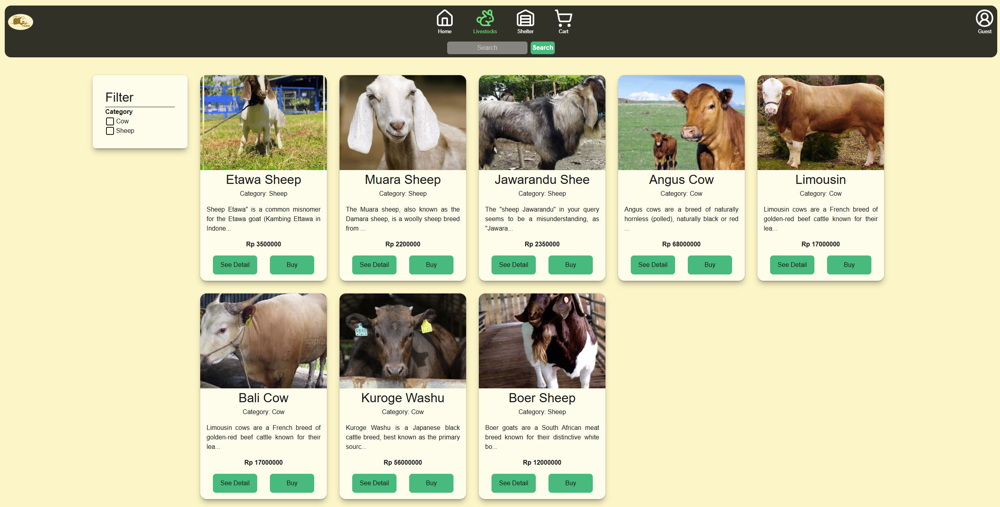

# 🐄 SmaFarm Frontend

SmaFarm is a modern platform for **livestock care and trading**, allowing users to:
- Rent shelters for livestock care
- Buy and sell livestock
- Allow breeders to register their farms and manage their livestock online

This repository contains the **frontend application** of SmaFarm, built with **Next.js**, **TypeScript**, and **Ant Design**, fully integrated with the SmaFarm backend API.

---

## 🚀 Tech Stack

- **Framework:** [Next.js](https://nextjs.org/) (v14+)
- **Language:** TypeScript
- **UI Library:** [Ant Design](https://ant.design/)
- **State Management:** React Context API
- **API Communication:** Fetch API / Axios
- **Date Handling:** Day.js
- **Authentication:** NextAuth.js

---

## ✨ Features

### 🐮 Livestock Care
- Search and filter shelters by location, price, and capacity  
- Book a shelter for your livestock for specific dates  
- Calendar with available slots and capacity status  
- Automatic calculation of total cost per transaction  

### 💰 Livestock Marketplace
- Browse livestock listings for sale
- Add livestock to the cart and checkout
- Manage purchase history

### 👨‍🌾 Farm Management for Breeders
- Breeders can register and manage their farm profiles
- Add, edit, and remove livestock from their farm listings
- Monitor care transactions for their shelters

### 🔐 Authentication & Profile
- Login and register 
- Manage user profiles with basic information and transaction history  

---

## ⚙️ Installation & Setup

Clone the repository:
```bash
git clone https://github.com/revou-fsse-feb25/final-project-fe-Salthof28.git

cd smafarm-frontend
```

Install dependencies:
```bash
pnpm install


Create an .env.local file:

NEXT_PUBLIC_API_URL=https://api.smafarn.com
NEXTAUTH_URL=http://localhost:3000
NEXTAUTH_SECRET=your_nextauth_secret
GOOGLE_CLIENT_ID=your_google_client_id
GOOGLE_CLIENT_SECRET=your_google_client_secret
```
Run the development server:
```bash
pnpm dev

Open http://localhost:3000
 in your browser.
```

## 🖼️ Screenshots
### Homepage
 
### Livestock Marketplace

### Form Buy Booking
 
### Form Care Booking
 
### Livestock Marketplace

### Profile User


## Author
🔧 Salman Althof