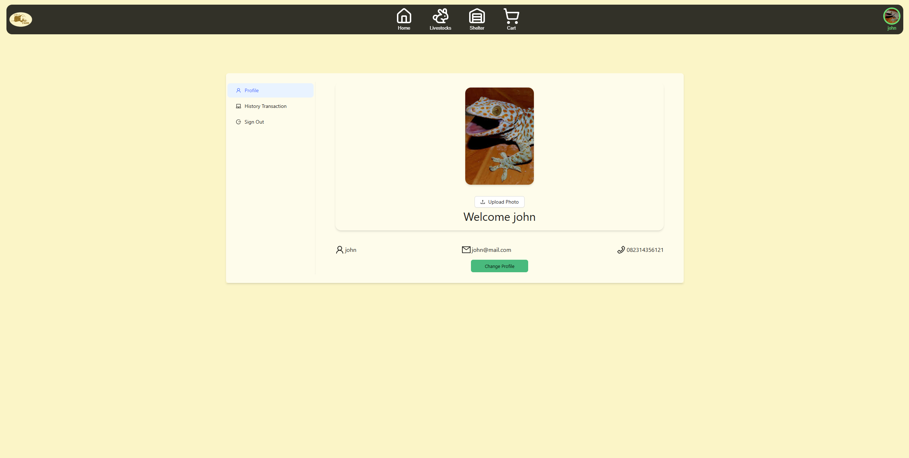

# 🐄 SmaFarm Frontend

SmaFarm is a modern platform for **livestock care and trading**, allowing users to:
- Rent shelters for livestock care
- Buy and sell livestock
- Allow breeders to register their farms and manage their livestock online

This repository contains the **frontend application** of SmaFarm, built with **Next.js**, **TypeScript**, and **Ant Design**, fully integrated with the SmaFarm backend API.

---

## 🚀 Tech Stack

- **Framework:** [Next.js](https://nextjs.org/) (v14+)
- **Language:** TypeScript
- **UI Library:** [Ant Design](https://ant.design/)
- **API Communication:** Fetch API
- **Date Handling:** Day.js
- **Authentication:** NextAuth.js

---

## ✨ Features

### 🐮 Livestock Care
- Search and filter shelters by location, price, and capacity  
- Book a shelter for your livestock for specific dates  
- Calendar with available slots and capacity status  
- Automatic calculation of total cost per transaction  

### 💰 Livestock Marketplace
- Browse livestock listings for sale
- Add livestock to the cart and checkout
- Manage purchase history

### 👨‍🌾 Farm Management for Breeders
- Breeders can register and manage their farm profiles
- Add, edit, and remove livestock from their farm listings
- Monitor care transactions for their shelters

### 🔐 Authentication & Profile
- Login and register 
- Manage user profiles with basic information and transaction history  

---

## ⚙️ Installation & Setup

Clone the repository:
```bash
git clone https://github.com/revou-fsse-feb25/final-project-fe-Salthof28.git

cd final-project-fe-salthof28
```

Install dependencies:
```bash
pnpm install


Create an .env.local file:

NEXTAUTH_SECRET=Your-Secret
```
Run the development server:
```bash
pnpm dev

Open http://localhost:3000
 in your browser.
```

## 🖼️ Screenshots
### Homepage
 
### Livestock Marketplace

### Form Buy Booking
 
### Form Care Booking
 
### Livestock Marketplace

### Profile User

### History Transaction Customer

### Dashboard Breeder

### Handle Livestock

### Edit Livestock

### Edit Shelter

### Handle Shelter

### History Order

### Dashboard Admin


## Link Demo

**Live Demo:** [smafarm-fe](https://smafarm-5u9a445j4-salthof28s-projects.vercel.app/)

## If You Want Test Login
### Admin
```bash
email: jane@mail.com
password: jane123
```
### Breeder
```bash
email: taiga@mail.com
password: taiga123
```
### Customer
```bash
email: john@mail.com
password: john123
```

## Author
🔧 Salman Altho